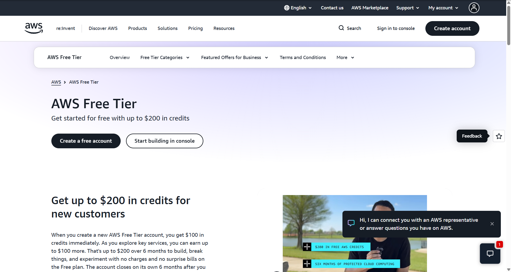

# Amazon Web Services (AWS) Research

## 1. Brief Overview

Amazon Web Services (AWS) is a cloud computing platform provided by Amazon. It offers a wide range of cloud services that organizations can use to build, deploy, manage, and scale applications and infrastructure.

AWS provides services for computing, storage, databases, networking, security, artificial intelligence, machine learning, analytics, and many other cloud computing requirements.

## 2. Global Infrastructure

AWS operates a large global cloud infrastructure consisting of geographic Regions and Availability Zones.

A Region is a separate geographic area where AWS provides cloud services. Within many Regions are multiple Availability Zones, which are separate locations designed to provide high availability and fault tolerance.

This infrastructure allows organizations to deploy applications closer to their users and design systems that can continue operating even when individual resources experience problems.

## 3. Cloud Management Console

The AWS Management Console is a web-based interface used to access and manage AWS services.

Through the console, users can create and configure resources, monitor services, manage security settings, view billing information, and control their cloud infrastructure.

**Screenshot:**

## 4. Four Core Services

### 4.1 Amazon EC2

Amazon Elastic Compute Cloud (EC2) provides virtual servers that can be used to run applications and workloads in the cloud.

### 4.2 Amazon S3

Amazon Simple Storage Service (S3) provides object storage for storing files, images, backups, documents, and other types of data.

### 4.3 Amazon VPC

Amazon Virtual Private Cloud (VPC) allows organizations to create and manage isolated virtual networks in AWS.

### 4.4 AWS IAM

AWS Identity and Access Management (IAM) allows administrators to manage users, roles, permissions, and access to AWS resources.

## 5. Three Advantages

### 5.1 Scalability

AWS allows organizations to increase or decrease cloud resources according to their workload requirements.

### 5.2 Wide Range of Services

AWS provides many different services for computing, storage, networking, databases, security, artificial intelligence, and other cloud requirements.

### 5.3 Global Infrastructure

AWS has a large global infrastructure that allows applications and services to be deployed in different geographic locations.

## 6. Typical Enterprise Use Cases

AWS can be used by enterprises for:

* Hosting websites and web applications
* Running virtual servers
* Storing and backing up data
* Database hosting
* Application development and testing
* Artificial Intelligence and Machine Learning
* Big data and analytics
* Disaster recovery
* Global application deployment

## Conclusion

AWS provides a broad collection of cloud services that can support organizations ranging from small startups to large enterprises. Its combination of computing, storage, networking, security, and other services makes it a flexible platform for many different cloud computing requirements.
