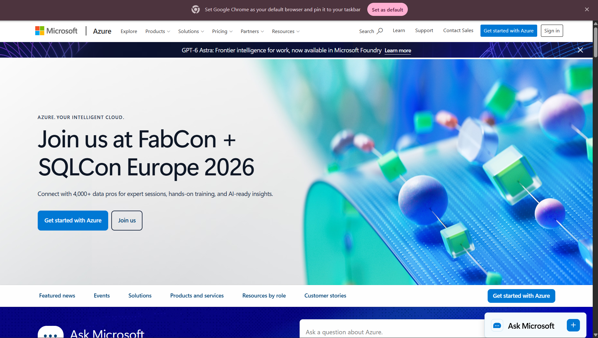

# Microsoft Azure Research

## 1. Brief Overview

Microsoft Azure is a cloud computing platform developed by Microsoft. It provides cloud services that organizations can use to build, deploy, manage, and scale applications and infrastructure.

Azure offers services for computing, storage, networking, databases, security, artificial intelligence, analytics, and application development.

## 2. Global Infrastructure

Microsoft Azure operates a global cloud infrastructure consisting of geographic regions and data centers around the world.

Azure regions allow organizations to deploy applications and services in different geographic locations. This helps improve application availability, performance, and reliability.

Azure also provides availability and redundancy features that help organizations design reliable cloud-based systems.

## 3. Cloud Management Console

The Azure Portal is a web-based management interface used to create, configure, monitor, and manage Azure resources.

Administrators can use the portal to manage virtual machines, storage, networking, databases, identities, security settings, and other cloud services.

**Screenshot:**

## 4. Four Core Services

### 4.1 Azure Virtual Machines

Azure Virtual Machines provide scalable virtual servers that can run Windows or Linux operating systems.

### 4.2 Azure Blob Storage

Azure Blob Storage is an object storage service designed to store large amounts of unstructured data such as documents, images, videos, and backups.

### 4.3 Azure Virtual Network

Azure Virtual Network allows organizations to create private networks and connect cloud resources securely.

### 4.4 Microsoft Entra ID

Microsoft Entra ID provides identity and access management for users, applications, and cloud resources.

## 5. Three Advantages

### 5.1 Microsoft Integration

Azure integrates strongly with Microsoft technologies such as Windows Server, Microsoft 365, and other Microsoft enterprise products.

### 5.2 Enterprise Features

Azure provides many services designed to support enterprise applications, security, identity management, databases, and infrastructure.

### 5.3 Global Availability

Azure provides cloud infrastructure in many geographic locations, allowing organizations to deploy applications close to their users.

## 6. Typical Enterprise Use Cases

Azure can be used by organizations for:

* Hosting web applications
* Running Windows and Linux virtual machines
* Cloud storage and backup
* Database hosting
* Microsoft enterprise environments
* Identity and access management
* Artificial Intelligence and Machine Learning
* Application development
* Hybrid cloud infrastructure

## Conclusion

Microsoft Azure is a powerful cloud platform that is particularly suitable for organizations already using Microsoft technologies. Its cloud infrastructure, enterprise services, identity management, and hybrid-cloud capabilities make it useful for many business environments.
