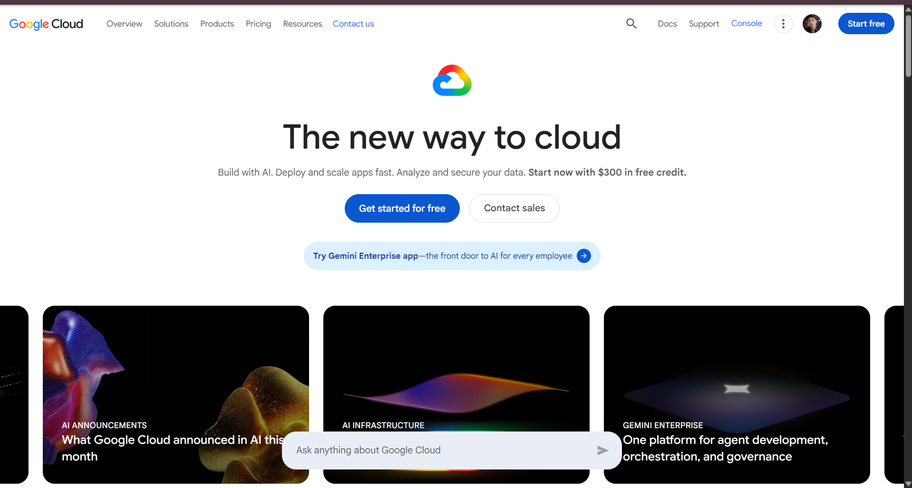

# Google Cloud Platform (GCP) Research

## 1. Brief Overview

Google Cloud Platform (GCP), commonly called Google Cloud, is a cloud computing platform provided by Google.

It provides services for computing, storage, databases, networking, artificial intelligence, machine learning, data analytics, and application development.

## 2. Global Infrastructure

Google Cloud operates a global infrastructure consisting of regions and zones located in different geographic areas.

Organizations can deploy their applications and resources across different regions and zones to improve availability, reliability, and performance.

Google's global infrastructure also supports large-scale data processing and distributed applications.

## 3. Cloud Management Console

The Google Cloud Console is a web-based interface that allows users to create, configure, monitor, and manage Google Cloud resources.

Users can manage virtual machines, storage, databases, networking, Kubernetes clusters, security settings, and other cloud services through the console.

**Screenshot:**

## 4. Four Core Services

### 4.1 Compute Engine

Google Compute Engine provides virtual machines that can be used to run applications and workloads in Google Cloud.

### 4.2 Cloud Storage

Google Cloud Storage provides object storage for files, backups, application data, and other unstructured data.

### 4.3 Virtual Private Cloud

Google Cloud VPC provides networking capabilities for connecting and securing cloud resources.

### 4.4 Google Kubernetes Engine

Google Kubernetes Engine (GKE) is a managed Kubernetes service used to deploy, manage, and scale containerized applications.

## 5. Three Advantages

### 5.1 Artificial Intelligence and Machine Learning

Google Cloud provides a wide range of services and tools for artificial intelligence and machine learning workloads.

### 5.2 Kubernetes

Google Cloud provides strong Kubernetes capabilities through Google Kubernetes Engine.

### 5.3 Data Analytics

Google Cloud provides services designed for large-scale data processing, analytics, and data management.

## 6. Typical Enterprise Use Cases

Google Cloud can be used for:

* Web application hosting
* Virtual machines
* Cloud storage
* Containerized applications
* Kubernetes deployments
* Artificial Intelligence and Machine Learning
* Big data processing
* Data analytics
* Application development
* Global applications

## Conclusion

Google Cloud provides a strong platform for organizations that require scalable infrastructure, data analytics, artificial intelligence, machine learning, and containerized application deployment. Its Kubernetes and AI capabilities make it an important option for modern cloud applications.
