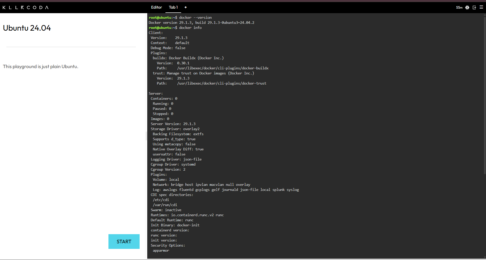
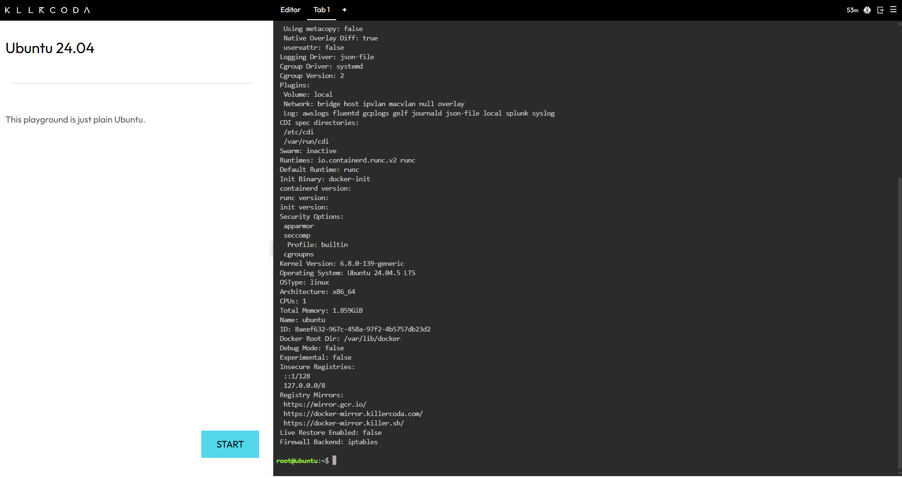
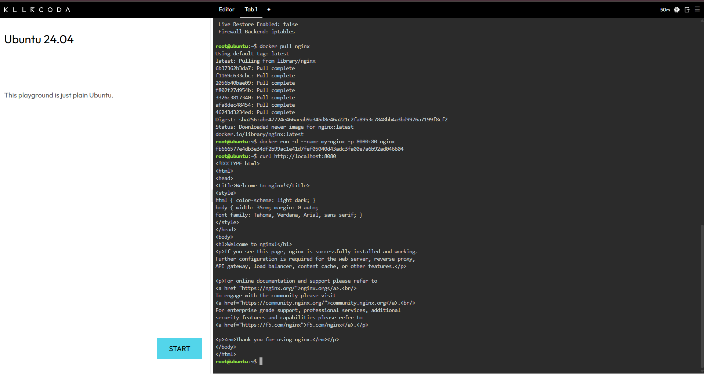
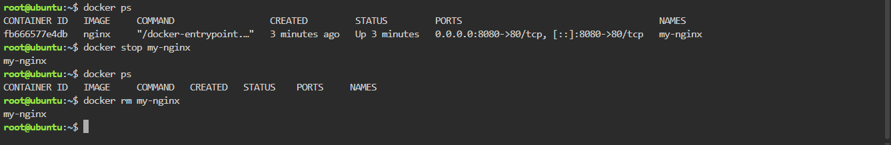

# Laboratory 04 – The Cloud-Native Engineer

## Mission Overview

Laboratory Activity 4 focuses on understanding cloud-native engineering through containerization. In this activity, I learned the differences between traditional Virtual Machines and Containers. I also used the KillerCoda Playground to execute Docker commands and deploy an Nginx web server inside a container.

The main goal of this laboratory was to understand how containers simplify application deployment, improve resource efficiency, and allow applications to run in isolated environments.

## Objectives

At the end of this laboratory activity, I was able to:

* Differentiate between Virtual Machines and Containers.
* Access a Docker-enabled cloud environment using KillerCoda.
* Execute fundamental Docker CLI commands.
* Pull and run an Nginx container.
* Map a host port to a container port.
* Manage the lifecycle of a Docker container.
* Document container operations using Markdown.
* Organize and update my GitHub Cloud Computing Portfolio.

## Docker Commands Executed

### Checkpoint 3 – Verify Docker

```bash
docker --version
docker info
```

These commands were used to check the installed Docker version and inspect the Docker environment.

### Checkpoint 4 – Deploy Nginx

```bash
docker pull nginx
docker run -d --name my-nginx -p 8080:80 nginx
curl http://localhost:8080
```

These commands were used to download the Nginx image, start a container, and verify that the web server was working.

### Checkpoint 5 – Container Lifecycle

```bash
docker ps
docker stop my-nginx
docker ps
docker ps -a
docker rm my-nginx
```

These commands were used to list, stop, inspect, and remove the Nginx container.

## Skills Learned

Through this laboratory, I learned how to use basic Docker commands and deploy a web server inside a container. I also improved my understanding of containerization, port mapping, and container lifecycle management. Additionally, I practiced writing technical documentation using Markdown and organizing evidence in my GitHub repository.

## Challenges Encountered

One challenge I encountered was understanding the purpose of port mapping and how the host communicates with a service running inside a container. I also needed to become familiar with Docker commands for managing containers. By following the instructions and observing the terminal output, I was able to understand the process and complete the deployment successfully.

## Screenshots

### Docker Environment





### Nginx Running



### Container Lifecycle



## Conclusion

This laboratory helped me understand the basic concepts of cloud-native engineering and how Docker containers can simplify application deployment. It also strengthened my practical Linux, Docker, and technical documentation skills.
